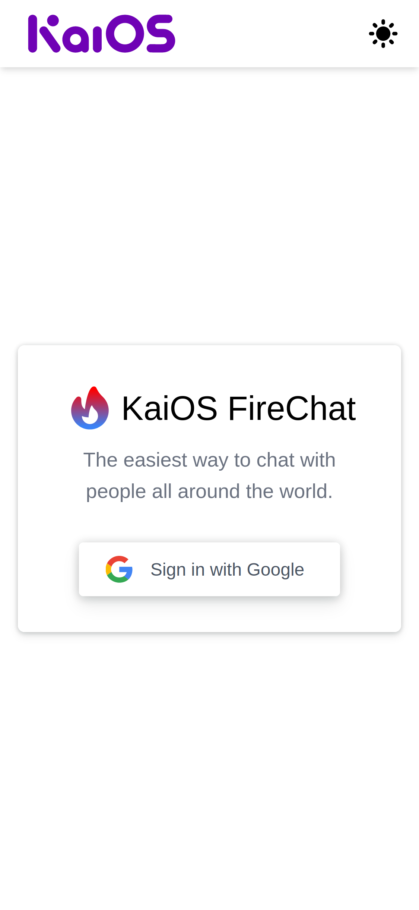
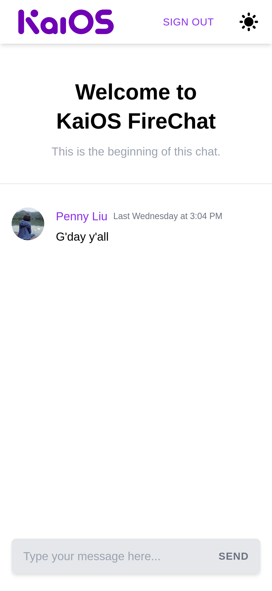

# NextJS FireChat

Source code of the NextJS FireChat app built with NextJS, Firebase, and Tailwind CSS. Deployed on Vercel.

> **NOTE:** This is ***not*** an official website, just for practice purposes.

## User Stories

A Real-time chat interface where multiple users can interact with each other by sending messages.
To enter the chat and interact with people, the user must log in using their Google account.
Once logged in, the user can read the previous messages (we limit it to 100 messages) from the chat and start chatting by sending messages.
## App Details


| Login Page | Chat Page  |
| :---:   | :-: |
|  |  |


### Instructions

1. Clone the project repository: `git clone https://github.com/ytliuSVN/nextjs-firechat.git`
2. Navigate to the project folder: `cd nextjs-firechat`
3. Install the dependencies: `npm install`
4. Start the app in the development mode: `npm run dev`

Open [http://localhost:3000](http://localhost:3000) with your browser to see the result.


### Loading Environment Variables

Copy and setup environment. An example `.env.local`:

```
NEXT_PUBLIC_FIREBASE_API_KEY=
NEXT_PUBLIC_FIREBASE_AUTH_DOMAIN=
NEXT_PUBLIC_FIREBASE_PROJECT_ID=
NEXT_PUBLIC_FIREBASE_STORAGE_BUCKET=
NEXT_PUBLIC_FIREBASE_MESSAGING_SENDER_ID=
NEXT_PUBLIC_FIREBASE_APP_ID=
```

## Useful links and resources

- [Next.js: Firebase Authentication and Middleware for API Routes](https://dev.to/dingran/next-js-firebase-authentication-and-middleware-for-api-routes-29m1)
- [Get up and running with Tailwind CSS and Next.js](https://dev.to/notrab/get-up-and-running-with-tailwind-css-and-next-js-3a73)
- [Build A REALTIME CHAT APP In 5 MIN With React And Firebase](https://alterclass.io/blog/build-a-realtime-chat-app-in-5-min-with-react-and-firebase)
